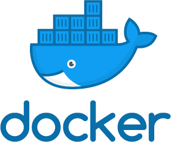

# Monitoring Microservices 
## with Prometheus

---

# 101: Introduction

- To us?

- To you?

- To the training...

---

## Timings

---

## Workshop Environments

---

## Access to Materials

---

## What on Earth Are We Doing?

Keep these questions in mind during the training

Please ask me questions (I might not know the answer, but it makes it more fun for me!)

---

## Monitoring

* What is monitoring? 
* Why should we do it? 
* When is it necessary? 
* How do we do it?

---

## Prometheus

* What is it? 
* What is different about it? 
* Why that and not others? 
* How do we use it?

---

## Assumptions

- Always question your assumptions (Is this right? What is that? Why? Etc.)

Why is you business interested in monitoring? What are their goals? What are their key _needs_?

Why are _you_ interested in monitoring? What do you want to know? Why do _you_ think we need monitoring?

---

## Your Users

The **business** wants to know that their users are being served _appropriately_.

The business is guaranteeing that their users receive their service:

- In a timely manner
- To an expected standard

---

## Your Code

**You** need to ensure that your work fulfils the business' needs.

You are guaranteeing:

- Availability
- Provides an expected service

---

## What is Normal?

In reality, when your service is running "normally", then your business is providing its service
"normally" and the user is "normally" happy with the service.

_Normal_ is the word I use to denote that services are functioning as designed.

This doesn't necessarily mean that the service can't fail.

When talking about user experience (UX) design, this is known as the "happy path".

---

## What Should we Monitor
### In a Nutshell?

- **Most important:** Anything that is not "normal". Anything "off the happy path".

If something goes wrong, it means your service is not providing the business with an expected level
of functionality. This (sometimes) has a knock on effect that means that the business is unable to
provide the service to a user. Bad!

- **Important in the future:** _How_ your users use your service, for subsequent analysis and
  optimisation.

---

## Docker

This course is focused towards Microservices. It is assumed that you have some working knowledge of:

- Microservices: Theory and implementation
- Docker: Practical use of

Given that we're packaging microservices as Docker containers, we're going to look at:

- How to monitor the resources used by containers
- How to monitor the state of a service running in the container

---

## Kubernetes

Because we're assuming containers in a Microservices architecture, we need an orchestrator.

We're going to learn how to:

- Monitor resource usage from Kubernetes
- Use kubernetes to set up our monitoring platform

---

## Prometheus

To achieve that, we're also going to investigate:

- Prometheus, a tool to monitor services in a Microservices architecture
- Theory: why, what, when and how to monitor. Which metrics. And a tiny bit of data science.
- Production use: Scaling, resiliency, alerting.

Many of these topics have practical examples.

