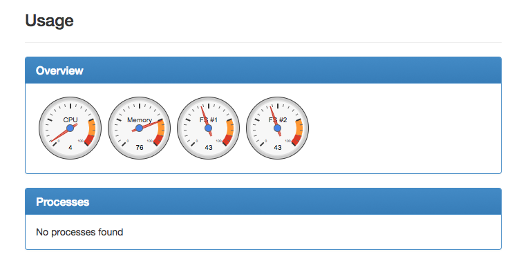
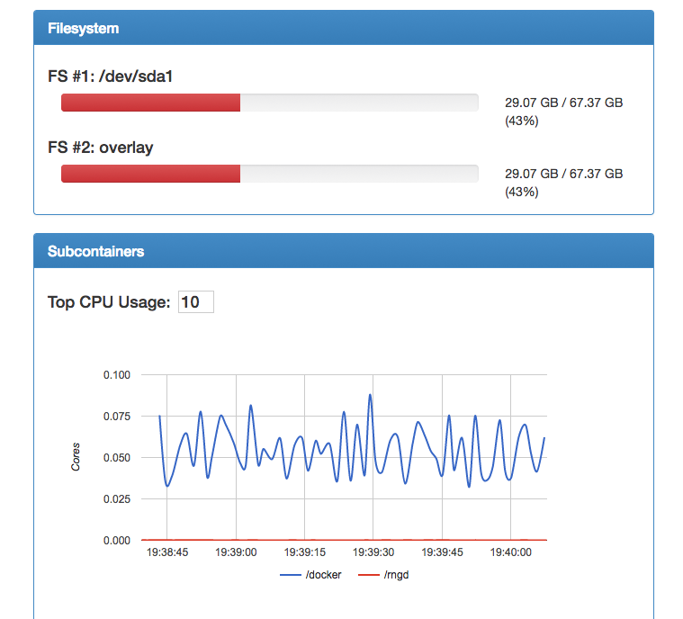
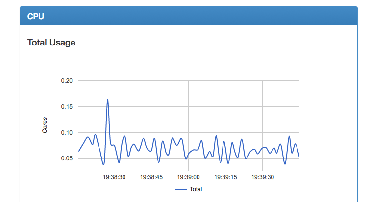

# 103: cAdvisor

---

cAdvisor [https://github.com/google/cadvisor](https://github.com/google/cadvisor) is a tool to
measure performance and resource usage of a container.

- Supports a range of containers:
    - rkt
    - SystemD
    - cri-o
    - Docker
- On a range of systems:
  - Linux
  - Windows
  - OSX


---

## How Does it Work?

- For each container, it records isolation parameters, resource usage in histogram form 
_(see later)_
and network statistics.

- It exposes that data via several HTTP based APIs.

- Save measurements to a database: Elasticsearch, Kafka, InfluxDB, BigQuery, Redis, StatsD and yes,
  Prometheus. Oh, and stdout!
  [https://github.com/google/cadvisor/tree/master/docs/storage](https://github.com/google/cadvisor/tree/master/docs/storage)

---

## Installation

In a container of course! _It's a go application, so statically compiled binaries are available._

```bash
$ docker run \
    --volume=/:/rootfs:ro \
    --volume=/var/run:/var/run:rw \
    --volume=/sys:/sys:ro \
    --volume=/var/lib/docker/:/var/lib/docker:ro \
    --publish=8080:8080 \
    --detach=true \
    --name=cadvisor \
    google/cadvisor:latest
```

_Note: This is a command for OSX. The Linux command differs subtly._

---

## cAdvisor Web Interface

If we browse to `http://<ip address>:8080`, we will see the web interface:


---



---



---



---

## Great: What's the Catch?

The catch is that this data is currently stored in Memory.

We've seen that there are various tools to expose metrics, but:

- Where do we store those metrics?
- How do we use and act upon those metrics?

This is actually a more difficult problem than it first seems (_and we'll get into this later_).

---

## Solution: The Prometheus API

Let's assume for now we're using Prometheus because it's awesome. ;-)

By default, cAdvisor has a `/metrics` endpoint (no trailing slash!).

```bash
$ curl http://localhost:8080/metrics
# HELP cadvisor_version_info A metric with a constant '1' value labeled by kernel version, OS version, docker version, cadvisor version & cadvisor revision.
# TYPE cadvisor_version_info gauge
cadvisor_version_info{cadvisorRevision="17543be",cadvisorVersion="v0.25.0",dockerVersion="17.09.0-ce",kernelVersion="4.9.49-moby",osVersion="Alpine Linux v3.4"} 1
# HELP container_cpu_system_seconds_total Cumulative system cpu time consumed in seconds.
# TYPE container_cpu_system_seconds_total counter
container_cpu_system_seconds_total{id="/"} 2745.43
container_cpu_system_seconds_total{id="/docker"} 1856.69
container_cpu_system_seconds_total{id="/rngd"} 4.95
container_cpu_system_seconds_total{id="/docker/73d0aecda143b9b7c6926c99dc595e4fb300d59395b4e8e59fb4ec6b03f53e9d",image="google/cadvisor:latest",name="cadvisor"} 10.52
container_cpu_system_seconds_total{container_label_com_docker_compose_config_hash="0ce1f21ba56400e9c3fbb65253dcc13276a5bb4e27c7469f4a6f9c4bec3ecdee",container_label_com_docker_compose_container_number="1",container_label_com_docker_compose_oneoff="False",container_label_com_docker_compose_project="102monitoringdocker",container_label_com_docker_compose_service="web",container_label_com_docker_compose_version="1.16.1",container_label_maintainer="NGINX Docker Maintainers <docker-maint@nginx.com>",id="/docker/c938d562e3f971190438df29d2a744414103d67f5f50ccd1eeaa422da70c6367",image="nginx:1.12-alpine",name="102monitoringdocker_web_1"} 88.33
# HELP container_cpu_usage_seconds_total Cumulative cpu time consumed per cpu in seconds.
...
```

---

## What is that format?

Good question. It's the Prometheus `Text Format`.

Pros:

- Human readable
- Easy to assemble
- East to parse

Cons:

- Super verbose
- Parsing cost
- No metric valdation

_(We will look at this in detail right at the end)_

---

## Hands-on

---
