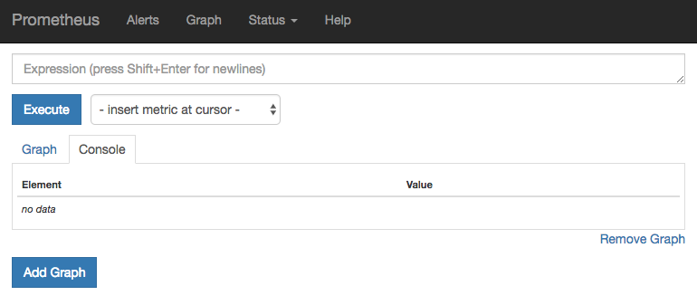
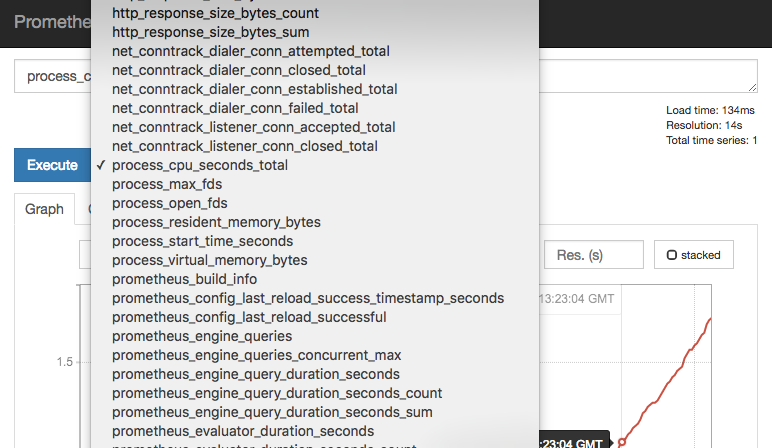
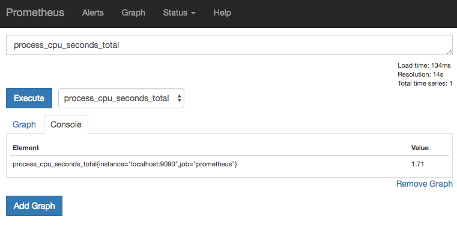
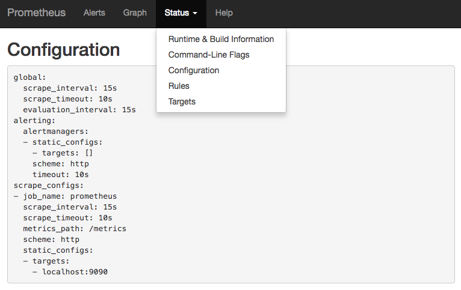
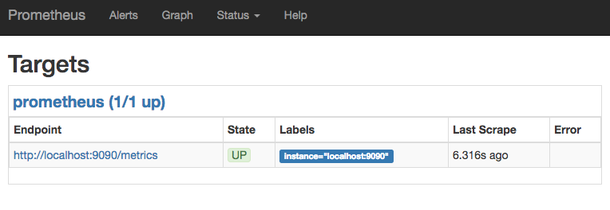
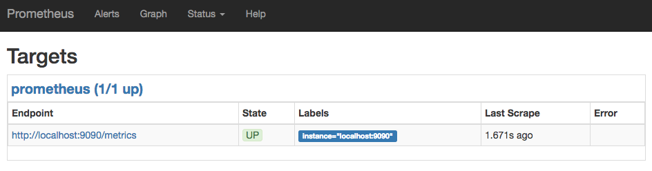
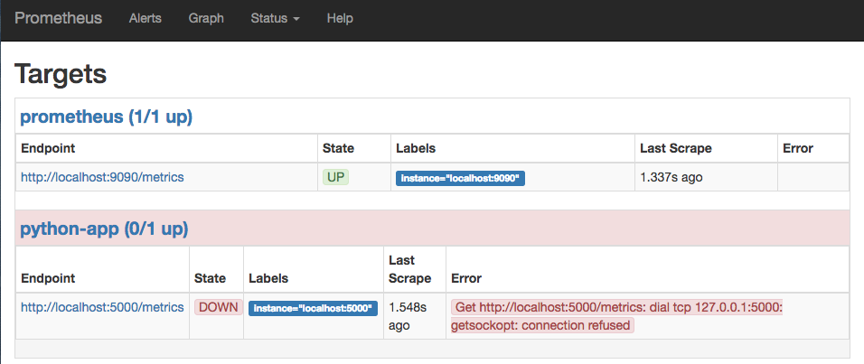
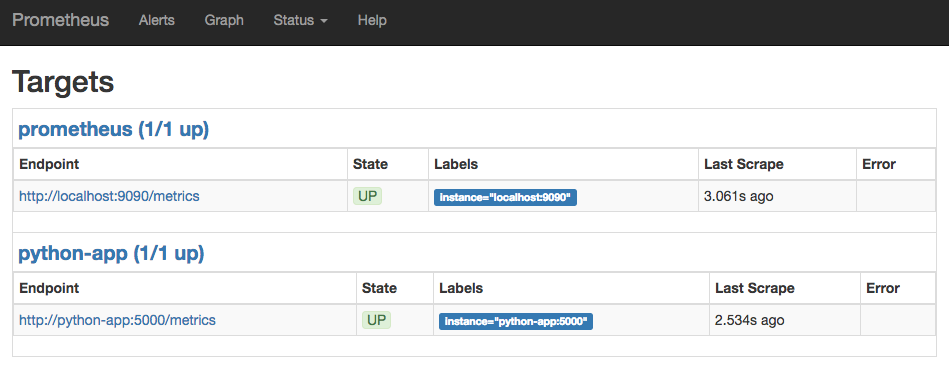
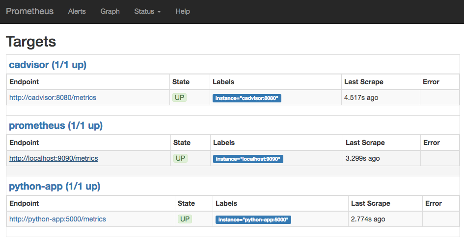
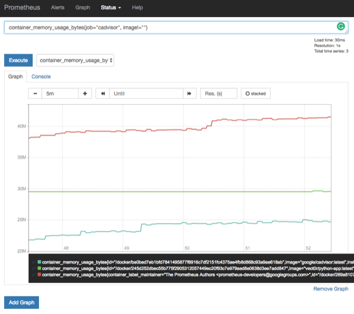

# 202: Using Prometheus

---

This section is all about starting and configuring Prometheus.

Hopefully you're excited to get your hands dirty. At the end there's a big workshop.

---

## Up and Running

How to install? You know the drill, Docker!

```bash
$ docker run -d -p 9090:9090 prom/prometheus
```

---

## Prometheus UI

When you first visit `http://<public ip address>:9090` you will be redirected to the **Graph** page.
(Not a graph! A plot!)

Here you can type your _query_ and view the results as a table or a
plot.

---

## Prometheus UI



---

### Selecting Metrics



---

### Results as a Table

This is the reading of this metric at this moment.



---

### Results as a Plot

These are the readings of the metric over a time period.


---

### Status

The status tab shows the current configuration of Prometheus. It is very useful for debugging configuration.



---

### Target Status

The Status->Targets option shows the scraping status at this moment. This is very useful for
debugging service status and scrape settings.



---

### Alerts

**Not Yet!**

We'll talk about alerts later.

### Help

This redirects to the Prometheus documentation.

---

## Prometheus Configuration

Prometheus is configured via command line flags and a configuration file.


---

### Configuration File

The configuration file contains the settings that you will alter on a day-to-day basis. Like adding
new endpoints to scrape, etc. ([more info](https://prometheus.io/docs/prometheus/latest/configuration/configuration/))

---

#### Global Configuration

Parameters that are valid in all configuration contexts. Also contain some defaults that can be
overidden in other sections. These are the most important global settings.

```yaml
global:
  # How frequently to scrape targets by default.
  [ scrape_interval: <duration> | default = 1m ]

  # How long until a scrape request times out.
  [ scrape_timeout: <duration> | default = 10s ]

  # How frequently to evaluate rules.
  [ evaluation_interval: <duration> | default = 1m ]

# A list of scrape configurations.
scrape_configs:
  [ - <scrape_config> ... ]
```

---

#### Scrape Configuration

The scrape configuration is the core of the configuration file. Here you specify how, where and when
Prometheus should scrape your metrics endpoint.

```yaml
# The job name assigned to scraped metrics by default.
job_name: <job_name>

# How frequently to scrape targets from this job.
[ scrape_interval: <duration> | default = <global_config.scrape_interval> ]

# Per-scrape timeout when scraping this job.
[ scrape_timeout: <duration> | default = <global_config.scrape_timeout> ]

# The HTTP resource path on which to fetch metrics from targets.
[ metrics_path: <path> | default = /metrics ]

# Configures the protocol scheme used for requests.
[ scheme: <scheme> | default = http ]
```

---

#### Scrape HTTP Settings and Security Credentials

```yaml
# Optional HTTP URL parameters.
params:
  [ <string>: [<string>, ...] ]

# Sets the `Authorization` header on every scrape request with the
# configured username and password.
basic_auth:
  [ username: <string> ]
  [ password: <secret> ]

# Sets the `Authorization` header on every scrape request with
# the configured bearer token. It is mutually exclusive with `bearer_token_file`.
[ bearer_token: <secret> ]

# Sets the `Authorization` header on every scrape request with the bearer token
# read from the configured file. It is mutually exclusive with `bearer_token`.
[ bearer_token_file: /path/to/bearer/token/file ]

# Configures the scrape request's TLS settings.
tls_config:
  [ <tls_config> ] # See the documentation for specifics.

# Optional proxy URL.
[ proxy_url: <string> ]
```

---

#### Discovery Configuration

Here you specify how and where Prometheus should resolve IP addresses.

```yaml
# List of Kubernetes service discovery configurations.
kubernetes_sd_configs:
  [ - <kubernetes_sd_config> ... ]

# List of labeled statically configured targets for this job.
static_configs:
  [ - <static_config> ... ]
```

There are also discovery mechanisms for: Azure, Consul, DNS, EC2, OpenStack, file, GCE, Marathon,
Nerve, ServerSet (Zookeeper), Triton.

---

#### Static Config

This allows you to specify a list of hard-coded targets and common label for them. You wouldn't
normally use this unless you are testing.

```yaml
# The targets specified by the static config.
targets:
  [ - '<host>' ] # DNS hostname or IP address followed by port number.

# Labels assigned to all metrics scraped from the targets.
labels:
  [ <labelname>: <labelvalue> ... ]
```

---

#### Kubernetes Config

These options allow you to specify what it is you want to discover. The `role` setting must be one
of: `endpoints`, `service`, `pod`, or `node`. Typically your default k8s config will have four jobs
each pointing to one of these roles.

There are also options to allow you to connect to a remote K8s cluster (not common).

---

#### Kubernetes Config

```yaml
# The API server addresses. If left empty, Prometheus is assumed to run inside
# of the cluster and will discover API servers automatically and use the pod's
# CA certificate and bearer token file at /var/run/secrets/kubernetes.io/serviceaccount/.
[ api_server: <host> ]

# The Kubernetes role of entities that should be discovered.
role: <role>

# Optional namespace discovery. If omitted, all namespaces are used.
namespaces:
  names:
    [ - <string> ]

# Optional authentication information used to authenticate to the API server.
# This is the same as the http security configuration above.
```

---

#### And More...

In my experience, they are the main settings you'll have to alter.

But there are a lot more. If you're doing this for real please do look at the
[documentation](https://prometheus.io/docs/prometheus/latest/configuration/configuration/).

---

### CLI Flags

The CLI flags are more related to the operation of the binary. E.g. information about storage
drivers, logging level, etc.

```bash
$ docker run -p 9090:9090 prom/prometheus -h
usage: prometheus [<flags>]

The Prometheus monitoring server

Flags:
  -h, --help                     Show context-sensitive help (also try
                                 --help-long and --help-man).
...
```

---

#### Important CLI Options

Here are some important cli parameters. There are more relating to how the data is stored and
options for hosting Prometheus behind a reverse proxy.

```bash
      --config.file="prometheus.yml"
                                 Prometheus configuration file path.
      --web.listen-address="0.0.0.0:9090"
                                 Address to listen on for UI, API, and
                                 telemetry.
      --storage.tsdb.path="data/"
                                 Base path for metrics storage.
      --storage.tsdb.retention=15d
                                 How long to retain samples in the storage.
      --log.level=info           Only log messages with the given severity or
                                 above. One of: [debug, info, warn, error]
```

---

## Example Configuration file: Simple

This is the simplest example you can have. A configuration scrape itself.

Go Scrape Yourself!

```yaml
global:
  scrape_interval:     15s
scrape_configs:
  - job_name: 'prometheus'
    scrape_interval: 5s
    static_configs:
      - targets: ['localhost:9090']
```

---

### Example Configuration with Docker

1. Write the configuration to a file
2. Pass the file into the container as a volume.

```bash
$ docker run -p 9090:9090 -v ${PWD}/prometheus.yml:/etc/prometheus/prometheus.yml prom/prometheus
```

---

When you run that, you'll see that we have Prometheus as a target. (This is the same as the default
configuration!)



---

## Example Configuration file: Our Custom App

```yaml
global:
  scrape_interval: 5s
scrape_configs:
  - job_name: 'prometheus'
    static_configs:
      - targets: ['localhost:9090']
  - job_name: 'python-app'
    static_configs:
      - targets: ['python-app:5000']
```

---

### Before we add the app



---

### After we add the app

```bash
$ docker run -p 5000:5000 -d \
  --name python-app vect0r/python-app:latest
$ docker run -p 9090:9090 \
  --link python-app \
  -v ${PWD}/prometheus.yml:/etc/prometheus/prometheus.yml prom/prometheus
```



---

## Example Configuration file: cAdvisor

```yaml
global:
  scrape_interval: 5s
scrape_configs:
  - job_name: 'prometheus'
    static_configs:
      - targets: ['localhost:9090']
  - job_name: 'python-app'
    static_configs:
      - targets: ['python-app:5000']
  - job_name: 'cadvisor'
    static_configs:
      - targets: ['cadvisor:8080']
```

And using the same docker command as we saw in the previous section results in:

---

### cAdvisor Target

_Don't forget the extra link._

```bash
$ docker run -d -p 9090:9090 --link cadvisor \
  --link python-app \
  -v ${PWD}/prometheus.yml:/etc/prometheus/prometheus.yml prom/prometheus
```



---

### cAdvisor Plot



---

## What's the Catch: Part Deux

- Just a database

- Plots are fine for development, but we can't continue using this for operational visualisation

- No alerting (yet!)

- Need to create lots of `/metrics` APIs

---

## Hands on!

Finally, some hands on time with Prometheus!

---

