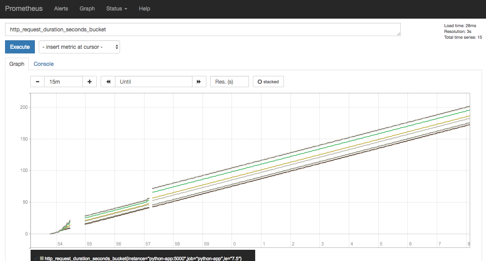

# Prometheus Queries

---

Up to now we haven't considered how to use the data we are collecting.

The most we've done is plotted a metric in the Prometheus Graph UI.

One important part of Prometheus is its query engine.

This allows you to perform simple mathematical operations of the time series data.


---

## What is a Query?

- Uses a functional expression language
- Select and aggregate time series data in real time

- Can be viewed as a plot, in a table or exported via the API

---

### The UI

You've already seen where you would type the queries in the UI. This is often the best place to
start developing a query.


---

### The API

Prometheus has a simple HTTP api to access all it's internal data. [docs](https://prometheus.io/docs/prometheus/latest/querying/api/)

This is what external tools use to get access.

```bash
$ curl 'localhost:9090/api/v1/query?query=process_cpu_seconds_total'
```

---

### The API

Where the query parameters may be:

* `query=<string>`: Prometheus expression query string.
* `time=<rfc3339 | unix_timestamp>`: Evaluation timestamp. Optional.
* `timeout=<duration>`: Evaluation timeout. Optional. Defaults to and is capped by the value of the `-query.timeout`

---

```json
{
  "status": "success",
  "data": {
    "resultType": "vector",
    "result": [
      {
        "metric": {
          "__name__": "process_cpu_seconds_total",
          "instance": "localhost:9090",
          "job": "prometheus"
        },
        "value": [
          1510237891.436,
          "0.42"
        ]
      }
    ]
  }
}
```

---

### Range of Data

To get a range of data we can use the `query_range` api.

```bash
$ curl 'localhost:9090/api/v1/query_range?query=process_cpu_seconds_total&start=2017-11-09T14:28:30.000Z&end=2017-11-09T14:29:30.000Z&step=10s'
```

---

### Range of Data

Where the query parameters are:

* `query=<string>`: Prometheus expression query string.
* `start=<rfc3339 | unix_timestamp>`: Start timestamp.
* `end=<rfc3339 | unix_timestamp>`: End timestamp.
* `step=<duration>`: Query resolution step width.
* `timeout=<duration>`: Evaluation timeout. Optional. Defaults to and is capped by the value of the `-query.timeout` flag.

---

```json
{
  "status": "success",
  "data": {
    "resultType": "matrix",
    "result": [
      {
        "metric": {
          "__name__": "process_cpu_seconds_total",
          "instance": "localhost:9090",
          "job": "prometheus"
        },
        "values": [
          [
            1510237710,
            "0.28"
          ],
          [
            1510237720,
            "0.29"
          ],
          [
            1510237730,
            "0.29"
          ],
          [
            1510237740,
            "0.31"
          ],
          [
            1510237750,
            "0.32"
          ],
          [
            1510237760,
            "0.32"
          ],
          [
            1510237770,
            "0.33"
          ]
        ]
      }
    ]
  }
}
```

---

### And More

Theres more to the API. You can also:

* Query by labels
* Targets
* Alert Managers

---

## Query Types

There are three main types of return values in Prometheus:

* **Instant vector** - a set of time series containing a single sample for each time series, all sharing the same timestamp
* **Range vector** - a set of time series containing a range of data points over time for each time series
* **Scalar** - a simple numeric floating point value

Depending on your query, you will receive these different results. [docs](https://prometheus.io/docs/prometheus/latest/querying/basics/)

---

### Instant and Range Vectors

When you use the table format, you will receive an instantaneous measurement.

When you use the plot format, you will receive a range of measurements.

Under the hood the two are using the `query` and `query_range` APIs we saw earlier.

---

### Filtering by Label

You may have already noticed this in previous examples.

To filter results by label, we provide key-value paris in curly braces:

`process_cpu_seconds_total{job="prometheus"}`

This allows us to select dimensions of interest.

---

### Filtering by Label

We can use `!` to negate the equality:

`process_cpu_seconds_total{job!="prometheus"}`

And we can also use `=~` as a regex and `!~` as a negative regex.

```
http_requests_total{environment=~"staging|testing|development",method!="GET"}
```

---

### Query Ranges

To select a range we use square braces (e.g. like indexing) to select an amount of time back from
the current instant. For example:

`http_requests_total{job="prometheus"}[5m]`

Will select the previous 5 minutes worth of data from the prometheus job.

---

### Query Ranges

Note that you won't be able to plot this in the Graph UI because that is performing a range query
(i.e. it's trying to append `[5m]` for you).

Images on the next few pages...

---


---


---

Time durations are specified as a number, followed immediately by one of the following units:
* `s` - seconds
* `m` - minutes
* `h` - hours
* `d` - days
* `w` - weeks
* `y` - years

---

### Offsetting Time

It's not something that you need to do often (maybe for a comparison to yesterday?) but you can also
offset the time:

`http_requests_total{job="prometheus"}[1m] offset 5m`

That is: "get a minute's worth of data from 5 minutes ago".

---

## Query Operators

There's the usual mathematical operators that do what you'd expect. [docs](https://prometheus.io/docs/prometheus/latest/querying/operators/#operators)

* `+` (addition)
* `-` (subtraction)
* `*` (multiplication)
* `/` (division)
* `%` (modulo)
* `^` (power/exponentiation)

---

## Query Operators

* `==` (equal)
* `!=` (not-equal)
* `>` (greater-than)
* `<` (less-than)
* `>=` (greater-or-equal)
* `<=` (less-or-equal)

But the most useful operators are the aggregations...

---

### Query Aggregations

There's a range of functions (similar to most math packages) to do sums, averages, min/max, etc.
[docs](https://prometheus.io/docs/prometheus/latest/querying/operators/#aggregation-operators)

Here are some of the most common...

---

### `sum`

Calculate the sum over all dimensions.

`sum(http_requests_total)`

You can specify the dimension to preserve when performing a sum. 

---

### `sum`

By default it sums everything
together. But we can provide:

`sum(http_requests_total[5m]) by (job)`

To provide a sum over all dimensions except `job`.

This is very useful for separating services/instances/API paths/API request types/errors/etc.

---

### `avg`

Calculate the average over all dimensions

`avg(http_requests_total)`

Same as: `sum(http_requests_total) / count(http_requests_total)`

---

## Query Functions

Prometheus has a range of helper functions. [docs](https://prometheus.io/docs/prometheus/latest/querying/functions/#histogram_quantile)

Here is a description of some of the most important.

---

### `rate`

[docs](https://prometheus.io/docs/prometheus/latest/querying/functions/#rate)

This is used all the time.

Calculates the per-second average rate of increase in a range vector.

I.e. It performs the calculation `observation[now] - observation[-1s]`

---

### `rate`

- Should only be used with counts

- When combining with another operator, always use the `rate` first.

E.g. Calculate the per-second rate of HTTP requests over the last 5 minutes.

`rate(http_requests_total{handler="query"}[5m])`

Image on next page...

---


---

### `histogram_quantile`

Calculate a percentile (0 <= q <= 1) from the buckets of a histogram metric.

E.g. The HTTP request duration of the 99.9th percentile (three nines):

`histogram_quantile(0.999, rate(http_request_duration_seconds_bucket[10m]))`

---

### `histogram_quantile`

E.g. The median:

`histogram_quantile(0.5, rate(http_request_duration_seconds_bucket[10m]))`

---

### `histogram_quantile`

E.g. Quantiles over all labels (e.g. over all APIs):

`histogram_quantile(0.9, sum(rate(http_request_duration_seconds_bucket[10m])) by (le))`

The `by (le)` is saying, sum for each `le` where le is the internal notation for a histogram bucket
boundary.

---

### And More

There are loads more. But it depends on what you're doing.

Check out the docs if you get stuck.

[https://prometheus.io/docs/prometheus/latest/querying/functions/](https://prometheus.io/docs/prometheus/latest/querying/functions/)

---

## Queries For Our Applications

Both our applications exposed the Histogram `http_request_duration_seconds`.

(Hopefully yours did too!)

We can use that to generate our own metrics.

---

### Let's start with something simple

`http_request_duration_seconds_count`

This shows the instantaneous value for the total number requests.

---

Here we're using the histogram to provide us with a counter. A histogram will create the following metrics:

- `http_request_duration_seconds_count` - Count of requests
- `http_request_duration_seconds_sum` - Sum of all durations
- `http_request_duration_seconds_bucket` - Histogram buckets

Image on next page...

---


---

### Convert That To a Rate

`rate(http_request_duration_seconds_sum[5m])`

This provides us with the rate of the number of requests over 5 minute sliding windows. I.e. this is
being smoothed.


---

### Look at the instantaneous rate (`irate`)

`irate(http_request_duration_seconds_sum[5m])`

Cool, that's just about queries per second.


---

### Histogram

`http_request_duration_seconds_bucket`

If we look at the raw histogram data, you'll see that its a combination of buckets, each of which
corresponds to a time "bin".



---

### Median Request Duration

`histogram_quantile(0.5, rate(http_request_duration_seconds_bucket[5m]))`

Note that you'll probably need to use a slow (delayed) API to get it to work slower than the lowest
default bucket.


---

### 99% Request Duration

`histogram_quantile(0.99, rate(http_request_duration_seconds_bucket[5m]))`

This one corresponds to your SLO/SLI.


---

## Hands On

Let's implement some queries for your apps.

---
