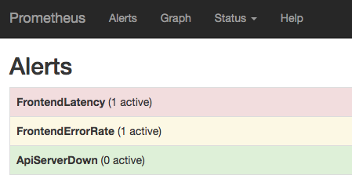
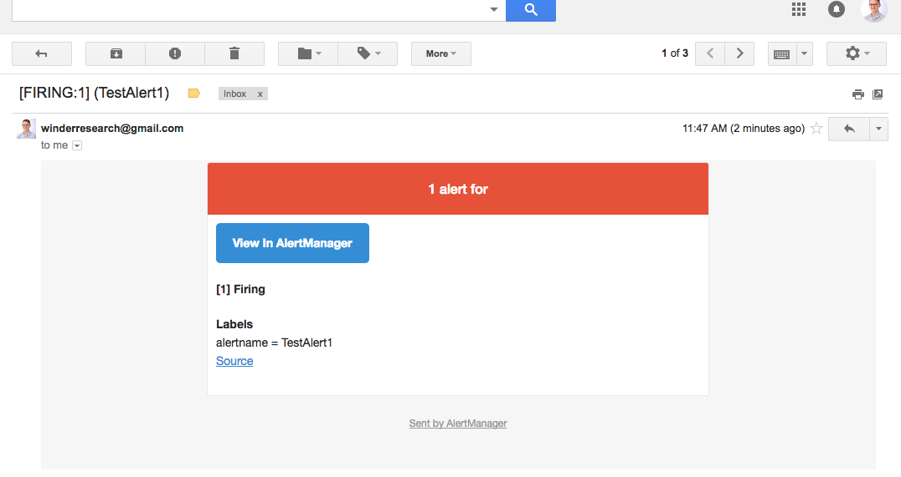
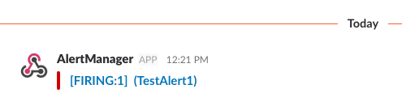

# 501: Alerting

---

We're now had lots of experience of analysing data, creating queries and visualising results on
dashboards.

However, one common use case is to broadcast an alert when certain queries pass a threshold.

In Prometheus, this is achieved by

- Alerting rules in Prometheus Core and
- A tool called [Alertmanager](https://github.com/prometheus/alertmanager)


---

## Architecture

### Prometheus

Prometheus is responsible for:

- Interpreting and implementing alerting rules
- Firing alerts

---

## Alertmanager

The Alertmanager is a small project that has three main responsibilities:

- Storing, aggregating and de-duplicating alerts
- Inhibiting and silencing alerts
- Pushing alerts out to external sources

---

## General Setup

- Create the alerting rules in Prometheus

- Configure the Alertmanager

- Conigure Prometheus to talk to Alertmanager

---

## Alerting Rules

_Note: There are two ways of defining rules. The pre 2.0 way, which was a text-based format or post
2.0 way which is yaml. I pick yaml for consistency._

```yaml
- alert: <Name>
  expr: <Query that evaluates to a boolean>
  for: <Length of time that this expression must be true>
  labels: # Used for routing
    <key>: <value>
  annotations: # Used for metadata and extra content.
    <key>: <value>
```

`for` waits for a certain amount of time before firing. Good for suppressing spikes.

`labels` allows additional identifying labels to be attached to the alert. Can be templated.

`annotations` allows for metadata to be attached to the alert.

---

### Alert example 1: Downed instances

This example will check if the k8s API server is down.

```yaml
  - alert: ApiServerDown
    expr: 'absent(up{job="kubernetes-apiservers"}) or sum(up{job="kubernetes-apiservers"}) < 1'
    for: 1m
    labels:
      severity: warning
    annotations:
      summary: 'Kubernetes API server down for 5m'
      description: 'Our Kubernetes cluster is inoperable. User impact uncertain.'
```

---

### Alert Example 2: Request Latency

This alert will fire if we have a high request duration.

```yaml
  - alert: FrontendLatency
    expr: 'histogram_quantile(0.95, sum(rate(http_request_duration_seconds_bucket[1m])) by (le,kubernetes_name)) > 2'
    for: 1m
    labels:
      severity: warning
    annotations:
      summary: 'frontend service: high latency'
      description: 'The frontend service has a 99th-quantile latency of {{$value}} s.'
```

Note the use of templates in the description. [documentation](https://prometheus.io/docs/prometheus/latest/configuration/template_reference/)

---

### Recording Rules

Note how the query is starting to get quite complex.

Prometheus allows us to specify [recording rules](https://prometheus.io/docs/practices/rules/).

Recording rules are queries that are evaluated upon each scrape and and written back to prometheus.

They allow you to replace complex queries with names to make them more understandable when reading.

E.g...

---

```yaml
  - record: 'job:request_errors:rate1m'
    expr: '(sum(rate(http_request_total{status_code=~"5..|error"}[1m])) by (kubernetes_name)) / (sum(rate(http_request_total[1m])) by (kubernetes_name))'
```

We can now create an alert like...

---

```yaml
  - alert: FrontendErrorRate
    expr: 'job:request_errors:rate1m{kubernetes_name="python-app"} > 0.1'
    for: 1m
    labels:
      severity: critical
    annotations:
      summary: 'frontend service: high error rate'
      description: 'The frontend service has an error rate (response code >= 500) of {{$value}} errors per second.'
```

---

### How Are Rules Passed into Prometheus?

To pass these rules into Prometheus we define a set of rule files.

In K8s we're going to do this in a ConfigMap.

The general format of a rule file is:

```yaml
groups:
- name: <unique_name_of_group>
  rules:
  - record: ...
  - alert: ...
  - alert: ...
```

E.g...

---

```yaml
groups:
- name: frontend
  rules:
  - record: 'job:request_errors:rate1m'
    expr: '(sum(rate(http_request_total{status_code=~"5..|error"}[1m])) by (kubernetes_name)) / (sum(rate(http_request_total[1m])) by (kubernetes_name))'
  - alert: FrontendErrorRate
    expr: 'job:request_errors:rate1m{kubernetes_name="python-app"} > 0.1'
    for: 1m
    labels:
      severity: critical
    annotations:
      summary: 'frontend service: high error rate'
      description: 'The frontend service has an error rate (response code >= 500) of {{$value}} errors per second.'
  - alert: FrontendLatency
    expr: 'histogram_quantile(0.95, sum(rate(http_request_duration_seconds_bucket[1m])) by (le,kubernetes_name)) > 2'
    for: 1m
    labels:
      severity: warning
    annotations:
      summary: 'frontend service: high latency'
      description: 'The frontend service has a 99th-quantile latency of {{$value}} s.'
```

Then we can pop that into a ConfigMap like this...

---

```yaml
apiVersion: v1
data:
  frontend-rules.yml: |
    groups:
    - name: frontend
      rules:
      - ...
  kubernetes-rules.yml: |
    groups:
    - name: kubernetes
      rules:
      - ...
kind: ConfigMap
metadata:
  creationTimestamp: null
  name: prometheus-rules
  namespace: monitoring
```

---

## How is that Passed into Prometheus?

Just a new volume:

```yaml
spec:
  template:
    spec:
      containers:
      - name: prometheus
      ...
        volumeMounts:
        - name: rules-volume
          mountPath: /etc/prometheus-rules
      volumes:
      - name: rules-volume
        configMap:
          name: prometheus-rules
```

---


And settings in `prometheus.yaml`:

```yaml
  prometheus.yml: |
    rule_files:
      - "/etc/prometheus-rules/*.yml"
```

---

Then hopefully, when you click on the `Alerts` tab in Prometheus you should see:



---

## Alertmanager Concepts

- **Grouping**: Group alerts so that only one is fired for a large event. E.g. network partition
  (you don't want a thousand alerts)

- **Inhibition**: Supress alerts if other alerts are already firing

- **Silences**: Mute alerts for a given time

---

## Alertmanager Configuration

_Warning: More yaml ahead!_

Some of the key global configuration options. See the
[documentation](https://prometheus.io/docs/alerting/configuration/) for more info.

```yaml
global:
  # Lots of global SMTP and URL options for receivers.

# Notification receivers.
receivers:
  - [<receiver>](https://prometheus.io/docs/alerting/configuration/#<receiver>) ...

# Routing alerts to notification receivers
route: [<route>](https://prometheus.io/docs/alerting/configuration/#<route>)

# A list of inhibition rules.
inhibit_rules:
  [ - [<inhibit_rule>](https://prometheus.io/docs/alerting/configuration/#<inhibit_rule>) ... ]
```

---

### Setting up Alertmanager Receivers

Receivers represent the tools and services that will receive your alerts.

Each has specific setting requirements so check out the [documentation](https://prometheus.io/docs/alerting/configuration/).

_Note that no new receivers are being added. They've decided to just allow webhooks. Everyone is
  free to implement a service based upon that webhook._

```yaml
    receivers:
    - name: 'slack_chatbots'
      slack_configs:
      - send_resolved: true
        api_url: 'https://hooks.slack.com/services/xxxxxxx'
        channel: '#chatbots'
        text: "<!channel> \\nsummary: {{ .CommonAnnotations.summary }}\\ndescription: {{ .CommonAnnotations.description }}"
    - name: 'pager_duty'
      pagerduty_configs:
      - service_key: xxxxxxxxxxxxxxxxxx
```

_Notes: Slack: note the text and templates. PagerDuty. Using Gmail and SMTP is cool for personal
projects_

---



---



---

### Alertmanager Routes

Routs allow you to direct alerts to specific receivers based the alert's labels.
[docs](https://prometheus.io/docs/alerting/configuration/#route)

E.g. Different teams.

```yaml
      routes:
      # This routes performs a regular expression match on alert labels to
      # catch alerts that are related to a list of services.
      - match:
          service: frontend
        receiver: slack_chatbots
        continue: true

      - match:
          service: backend
        receiver: pager_duty
        continue: true
```

---

### Alertmanager Inhibitions

Inhibitions allow you to selectively overrule alerts based upon their labels.
[docs](https://prometheus.io/docs/alerting/configuration/#inhibit_rule)

E.g. Severity.

```yaml
    inhibit_rules:
    - source_match:
        severity: 'critical'
      target_match:
        severity: 'warning'
      # Apply inhibition if the alertname is the same.
      equal: ['alertname']
```

Inhibition is a quite advanced technique. I would recommend not providing inhibitors initially to
prevent mistakes. Add only when you need to.

---

### Alertmanager Extras

- You can provide external template files for your notifications. E.g. A generic template for slack
  messages, etc. [Good blog post](https://prometheus.io/blog/2016/03/03/custom-alertmanager-templates/)

- The Alertmanager is the one component that needs to be distributed in a mesh, since duplicate
  alertmanagers will send out duplicate notifications. We'll talk about this in the HA section.

---

## Alerting Best Practices

- Keep it simple! As few alerts as possible.
- Alert on symptoms that affect your users
- Good consoles and dashboards to find causes. Link to them in the alert.
- Develop Playbooks/Runbooks that describe what errors mean, their likely causes, how to fix and who
  to ask for help

References:
- [My Philosophy on Alerting - Rob Ewaschuk](https://docs.google.com/a/boxever.com/document/d/199PqyG3UsyXlwieHaqbGiWVa8eMWi8zzAn0YfcApr8Q/edit)
- [Prom Docs](https://prometheus.io/docs/practices/alerting/)

Some common alerting use cases...

---

### Alerting for Online Services

- High latencies
- Error rates

### Offline Processing

- Duration of job

### Batch Jobs

- Duration of jobs
- Failed jobs

---

### Capacity Monitoring

- Close to capacity

### Meta-Monitoring - Monitor the monitors!

- Alerts for Prometheus, alertmanagers, other monitoring infra

---

## Hands on

---

## Thats It!

- If there is anything that you think should belong in this traing, please let us know.

- If some of it was too hard, or too difficult, please let us know.

- I've also provided an appendix which has links to loads more documentation, talks and blog posts.

Thanks!

---
