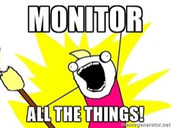

# 204: Instrumenting Applications

In this workshop you will be creating your own instrumented application!

I'm not going to provide much guidance here. Please feel free to try new things.
---
## Example Repositories

To get you started, I've created some examples.

- **Python**: [https://github.com/philwinder/prometheus-python](https://github.com/philwinder/prometheus-python)
- **Java Spring Boot**: [https://github.com/philwinder/prometheus-java-spring-boot](https://github.com/philwinder/prometheus-java-spring-boot)

Please feel free to use/borrow/steal anything you like from there.
---
## Client Libraries

If you need to check the client library documentation, you can find links to all the implementations
here:
[https://prometheus.io/docs/instrumenting/clientlibs/](https://prometheus.io/docs/instrumenting/clientlibs/)
---
## Your Turn!

1. Pick a language
2. Write a webserver
3. Add the instrumentation
4. Wrap in a docker container

_You may encounter a range of issues. E.g. build tools, firewalls, etc._

We're going to spend quite a bit of time doing this, to allow you to experiment. Feel free to go
off-piste!

Some more ideas:

- Spin up Prometheus, plot the results of your instrumentation
- Add a:
  - Counter
  - Gauge
  - Histogram
  - Summary
- Try changing the default bin allocations for the histogram (important for long running jobs!)
- Try altering the Summary settings
- Add some random delays in there to make it more interesting
- Write a docker-compose file to start both your container and prometheus
- Push your code to Github to prove your awesomeness! :-D

