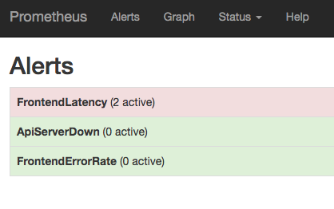
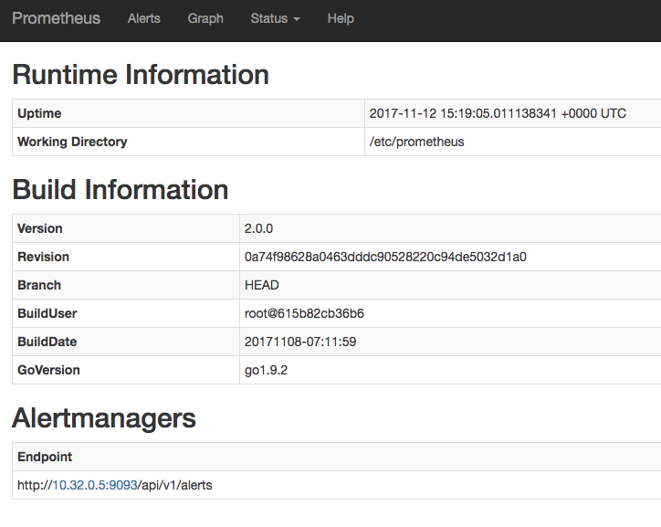
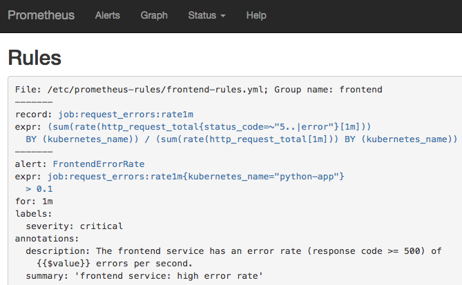
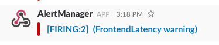

## 501: Alerting

In this fun workshop you will be creating an alerting system!

There are two key components:

- Alerting rules inside prometheus
- Alertmanager tool to publish alerts

First we'll create some alerting rules using our Kubernetes configs, then we'll setup alert manager
and finally your tasks will be to integrate alertmanager with the k8s configs and produce an
end-to-end monitoring system!
---
## Clean up

Remove all previous containers/k8s pods/docker-compose's etc.

```bash
$ kubectl delete ns monitoring apps
```
---
## Prometheus Alerting Rules

### Spin Up My Example

In this example I provide three alert rules then add that ConfigMap as a volume.

We're still using the Python app as an example. As always, feel free to add your own.

```bash
$ cd <workshop directory>/501-alerting
$ kubectl apply -f manifest.yml
```

- Browse to Prometheus and click on the Alerting tab. Check that the alerts are there.
- Are the queries working for those alerts? Click around and double check.
- Do any of those alerts fire?
---
### Adding Your Own Alerting Rules

- Add a new alert rule that alerts when the python-app is down
  - Delete the python-app deployment to test that it is working
- Add a new recording rule that alerts when the number of received requests is low
  - Call the recording rule in the query browser to check it is working
- Add a new alert that uses the previous recording rule
  - Delete the python-load deployment to test that it is working
---
## Alert Manager

First we're going to make sure the alert manager configuration works by running it as a simple
docker container. Once it's working you can port it to Kubernetes.

There are two tasks:

- Alerting via your personal gmail account
- Alerting via Slack

If you can't do one of them for whatever reason, don't worry too much. But you should try and find
some way of making at least one receiver work.

E.g. Setup a new personal slack channel, it's free and quick to do.
---
### Using Gmail To Send Alerts to Yourself

To setup alerts using gmail's smtp servers you'll need to create an `App Password` [https://myaccount.google.com/apppasswords](https://myaccount.google.com/apppasswords).

If you try and use your root account password, google will flag it as unauthorised activity.

To create an `App Password` you **must have 2-factor authentication turned on**.

Create the alertmanager settings file inside your VM:

```bash
GMAIL_ACCOUNT=XXXXXXX@gmail.com # Add your email address
GMAIL_AUTH_TOKEN=XXXXXXX        # Substitute in your app password

cat <<EOF > alertmanager.yml
route:
  group_by: [Alertname]
  # Send all notifications to me.
  receiver: email-me

receivers:
- name: email-me
  email_configs:
  - to: $GMAIL_ACCOUNT
    from: $GMAIL_ACCOUNT
    smarthost: smtp.gmail.com:587
    auth_username: "$GMAIL_ACCOUNT"
    auth_identity: "$GMAIL_ACCOUNT"
    auth_password: "$GMAIL_AUTH_TOKEN"
EOF
```
---
Run the alertmanager and turn on debugging:

```bash
docker run -d --name alertmanager -p 9093:9093 -v $PWD/alertmanager.yml:/etc/alertmanager/config.yml prom/alertmanager:v0.10.0 -log.level=debug -config.file=/etc/alertmanager/config.yml
```

Make sure the container is running ok:

```bash
docker logs -f alertmanager
```

Now generate an alert by hitting the API:

```bash
curl -H "Content-Type: application/json" -d '[{"labels":{"alertname":"TestAlert1"}}]' localhost:9093/api/v1/alerts
```

*Note, it takes a minute for the email. Prometheus has a `group_wait` option in the routes to
de-duplicate multiple alerts before sending.*
---
### Using Slack to Send Slack Messages to Your Team

We need to install the `Incoming Webhooks` Slack app.

1. Login to the Slack web UI
2. Browse to
   [https://slack.com/apps/A0F7XDUAZ-incoming-webhooks](https://slack.com/apps/A0F7XDUAZ-incoming-webhooks)
3. Make sure you have the right slack team selected.
4. Click "Install" if you don't have it installed. If you do you'll see"Add configuration".
5. In the `Post to Channel` card, select the default channel you want to post to. Then click on the
   confirmation button.
6. Copy the Webhook URL
---
Now use the folling configuration. Paste this on your VM. Change the webhook url. You also might
want to change the channel to `@<yourname>` to prevent spamming everyone.

```bash
WEBHOOK_URL=XXXXXXX # Your webhook URL

cat <<EOF > alertmanager.yml
route:
 group_by: [cluster]
 # If an alert isn't caught by a route, send it slack.
 receiver: slack_general
 routes:
  # Send severity=slack alerts to slack.
  - match:
      severity: slack
    receiver: slack_general

receivers:
- name: slack_general
  slack_configs:
  - api_url: $WEBHOOK_URL
    channel: '#general'
EOF
```
---
Run the alertmanager and turn on debugging.

```bash
docker run -d --name alertmanager -p 9093:9093 -v $PWD/alertmanager.yml:/etc/alertmanager/config.yml prom/alertmanager:v0.10.0 -log.level=debug -config.file=/etc/alertmanager/config.yml
```

Make sure the container is running ok:

```bash
docker logs -f alertmanager
```

Now generate an alert by hitting the API

```bash
curl -H "Content-Type: application/json" -d '[{"labels":{"alertname":"TestAlert1"}}]' localhost:9093/api/v1/alerts
```

_Note: It takes a minute for the message. Prometheus has a `group_wait` option in the routes to
de-duplicate multiple alerts before sending._
---
### Ingegrating Alertmanager with Kubernetes

Now, integrate this configuration with your Kubernetes manifest.
---
#### Service Discovery

There's only one tricky bit and that's setting the Alertmanager discovery options in the Prometheus
configuration. [docs](https://prometheus.io/docs/prometheus/latest/configuration/configuration/#<alertmanager_config>)

_Note that the docs appear to be wrong here (as of 12/11/17). It is not possible to specify
`alertmanager.url` as of 2.0._

This is what we need to add:

```yaml
alerting:
  alertmanagers:
  - kubernetes_sd_configs:
      - role: pod
    relabel_configs:
    # Drop all pods except the pods not in the monitoring namespace
    - source_labels: [__meta_kubernetes_namespace]
      regex: monitoring
      action: keep
    # Drop all pods except the pod named: alertmanager
    - source_labels: [__meta_kubernetes_pod_name]
      regex: 'alertmanager.*'
      action: keep
    # With a non-empty port
    - source_labels: [__meta_kubernetes_pod_container_port_number]
      regex:
      action: drop
```
---
This adds an alertmanager that's using a Kubernetes service discovery mechanism (lots of others
exist too -
[docs](https://prometheus.io/docs/prometheus/latest/configuration/configuration/#alertmanager_config))
and filters for the pods that are in a namespace of `monitoring`, the pods are named
`alertmanager.*` (the regex is because k8s appends a UID to the pod names) and it must have a
non-empty port.

We don't need to specify k8s certificates here because we are actually running inside the cluster.

You can check to see if Prometheus has found your alertmanager by looking at the bottom of
`http://<public_ip>:31503/status`. An endpoint should be listed.
---
#### Over to You!

You should be able to figure everything else out.

Tasks:

1. Integrate the Alertmanager with Kubernetes.
   1. Test that your alertmanager config works with the standalone test (see gmail or slack examples)
   2. Add the alertmanager configuration
   3. Add the ConfigMap as a volume.
   4. Alter the Prometheus configuration to point to your alertmonitor
   5. Make sure Prometheus can communicate with Alertmanager
      [docs](https://prometheus.io/docs/prometheus/latest/configuration/configuration/#alertmanager_config)
      \- see above
2. Add alert rules to the prometheus configuration
   1. Make sure your queries work first
   2. Add them to the config
   3. Check that they are read by Prometheus by browsing to `http://<public_ip>:31503/alerts`
   4. Check that they are firing (if you expect them to)
3. Sit back and watch the alerts roll in!
---
Your setup should show something like the following images:


---

---

---

---
### Help

If you get stuck, please feel free to ask for help.

If you get really stuck, then there is a working manifest in `501-alerting/manifest-alerting.yml`
(except I have put some dummy credentials in there).
